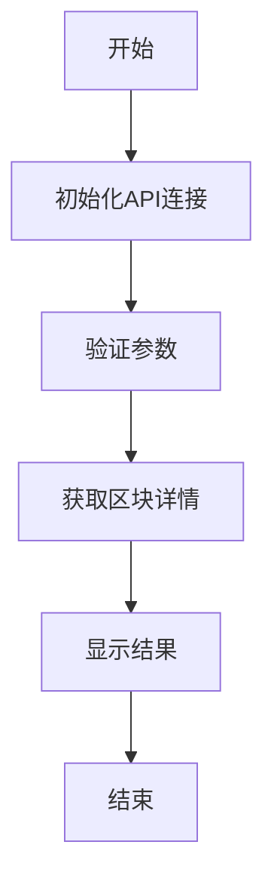

# Block命令详解

## 功能说明
block命令提供区块信息查询功能，主要包括：
- 按时间范围查询区块详情
- 显示区块元数据（哈希、时间戳等）
- 展示链上统计信息

## 执行流程图


## 参数说明
| 参数 | 缩写 | 必填 | 说明 |
|------|------|------|------|
| --time-range | -t | 否 | 时间范围(如2h,3d,1w,1m,1y) |

## 处理逻辑
1. **初始化阶段**:
   - 连接区块链节点RPC
   - 初始化数据源连接
   - 验证输入参数

2. **查询执行**:
   - 获取指定时间范围的区块详情
   - 计算链上统计信息
   - 格式化结果用于显示

3. **输出阶段**:
   - 显示格式化后的结果
   - 清理资源

## 典型使用场景
```bash
# 查询过去24小时的区块
pnpm start block -- --time-range=1d

# 查询过去一周的区块
pnpm start block -- --time-range=1w

# 查询过去一个月的区块
pnpm start block -- --time-range=1m
