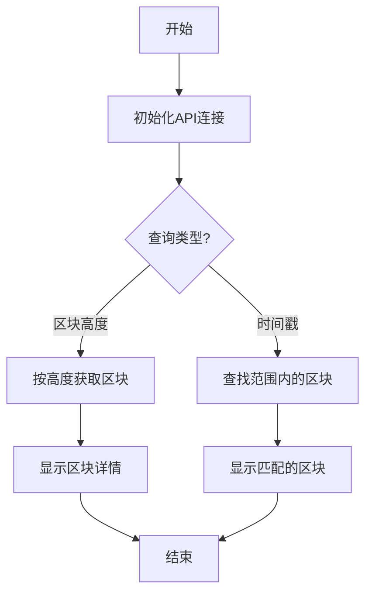

# Block命令详解

## 功能说明
block命令提供区块信息查询功能，主要包括：
- 按高度查询区块详情
- 按时间范围搜索区块
- 显示区块元数据（哈希、时间戳等）
- 展示交易/事件数量

## 执行流程图


## 参数说明
| 参数 | 缩写 | 必填 | 说明 |
|------|------|------|------|
| --block | -b | 否 | 要查询的区块号 |
| --startTime | -s | 否 | 开始时间戳(ISO格式) |
| --endTime | -e | 否 | 结束时间戳(ISO格式) |
| --chain | -c | 否 | 链名称(默认acala) |

## 处理逻辑
1. **初始化阶段**:
   - 连接区块链节点RPC
   - 验证输入参数

2. **查询执行**:
   - 对于区块号查询:
     - 获取完整区块详情
     - 统计交易/事件数量
   - 对于时间戳查询:
     - 使用二分查找定位范围内的区块
     - 显示匹配区块的摘要

3. **输出格式化**:
   - 美化JSON数据展示
   - 高亮关键信息
   - 包含查询时间等元数据

## 典型使用场景
```bash
# 查询特定区块
pnpm start block -- --block=1234567

# 查找时间范围内的区块
pnpm start block -- --startTime="2025-01-01T00:00:00Z" --endTime="2025-01-02T00:00:00Z"

# 指定链查询
pnpm start block -- --block=1234567 --chain=bifrost
