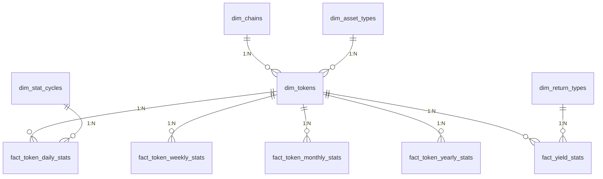

# 数据库结构文档

## 整体架构

数据库采用星型模型设计，包含：
- **原始数据表**：存储从各链提取的原始数据
- **维度表**：存储业务维度信息
- **事实表**：存储业务指标数据



## 原始数据表

### Acala链
| 表名 | 说明 |
|------|------|
| acala_block | 存储区块基本信息 |
| acala_event | 存储链上事件 |
| acala_extrinsic | 存储交易信息 |
| acala_batchlog | 记录批处理日志 |

### Bifrost链
| 表名 | 说明 |
|------|------|
| Bifrost_site_table | 存储站点TVL/APY等数据 |
| Bifrost_staking_table | 存储质押数据 |
| Bifrost_batchID_table | 记录批处理ID |

### Stellaswap
| 表名 | 说明 |
|------|------|
| pool_data | 存储流动性池数据 |

### Hydration
| 表名 | 说明 |
|------|------|
| hydration_data | 存储收益数据 |

## 维度表

| 表名 | 说明 |
|------|------|
| dim_asset_types | 资产类型(DeFi/GameFi/NFT) |
| dim_chains | 区块链网络信息 |
| dim_return_types | 收益类型(Staking/Farming) |
| dim_stat_cycles | 统计周期(daily/weekly等) |
| dim_tokens | 代币基础信息 |

## 事实表

| 表名 | 说明 |
|------|------|
| fact_token_daily_stats | 代币每日统计 |
| fact_token_weekly_stats | 代币每周统计 |
| fact_token_monthly_stats | 代币每月统计 |
| fact_token_yearly_stats | 代币每年统计 |
| fact_yield_stats | 收益率数据 |

## 与ETL流程的关系

### Extract命令
1. 从各链提取原始数据
2. 写入对应链的原始数据表
3. 记录处理日志到batchlog表

### Transform命令
1. 从原始数据表读取数据
2. 关联维度表进行数据转换
3. 计算结果写入事实表
4. 生成不同周期的统计指标

## 典型查询示例

```sql
-- 查询某代币最近30天的交易数据
SELECT * FROM fact_token_daily_stats 
WHERE token_id = 123 AND date >= DATE_SUB(NOW(), INTERVAL 30 DAY);

-- 查询各链TVL排名
SELECT c.name, SUM(f.tvl_usd) as total_tvl
FROM fact_yield_stats f
JOIN dim_tokens t ON f.token_id = t.id
JOIN dim_chains c ON t.chain_id = c.id
GROUP BY c.name
ORDER BY total_tvl DESC;
