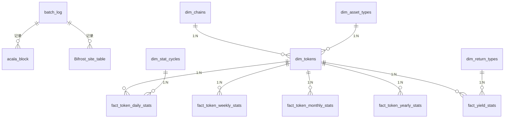

# 数据库结构文档

## 数据库架构

系统使用三个独立的数据库：

### 1. 批处理数据库 (QUERYWEB3_BATCH)
- 存储批处理任务执行日志
- 主要表：
  - batch_log: 记录批处理任务状态和执行日志

### 2. 提取数据库 (QUERYWEB3_EXTRACT)
- 存储从各链提取的原始数据
- 按链分表存储：
  - Acala链: acala_block, acala_event, acala_extrinsic
  - Bifrost链: Bifrost_site_table, Bifrost_staking_table
  - Stellaswap: pool_data
  - Hydration: hydration_data

### 3. 转换数据库 (QUERYWEB3)
- 存储转换后的维度模型数据
- 包含：
  - 维度表: dim_asset_types, dim_chains等
  - 事实表: fact_token_daily_stats等

## 详细表结构



## 配置说明

在.env文件中需要配置三个数据库的连接信息：

```env
# 批处理数据库
BATCH_DB_HOST="127.0.0.1"
BATCH_DB_PORT="3306"
BATCH_DB_USER="root"
BATCH_DB_PASSWORD="password"
BATCH_DB_NAME="QUERYWEB3_BATCH"

# 提取数据库
EXTRACT_DB_HOST="127.0.0.1"
EXTRACT_DB_PORT="3306"
EXTRACT_DB_USER="root"
EXTRACT_DB_PASSWORD="password"
EXTRACT_DB_NAME="QUERYWEB3_EXTRACT"

# 转换数据库
TRANSFORM_DB_HOST="127.0.0.1"
TRANSFORM_DB_PORT="3306"
TRANSFORM_DB_USER="root"
TRANSFORM_DB_PASSWORD="password"
TRANSFORM_DB_NAME="QUERYWEB3"
```

## 初始化说明

使用migration命令初始化数据库：

```bash
# 初始化所有数据库
pnpm start migration --all

# 或单独初始化某个数据库
pnpm start migration --batch
pnpm start migration --extract
pnpm start migration --transform
```

## 表详细说明

(保留原有的表详细说明内容...)
