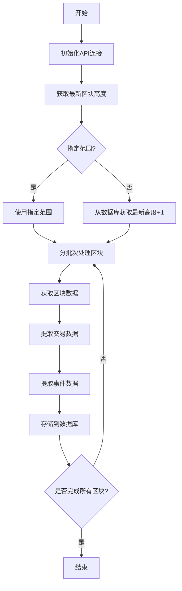

# Extract命令详解

## 功能说明
extract命令用于从区块链网络提取原始数据，包括：
- 区块基本信息
- 交易(extrinsic)数据
- 事件(event)数据
- 相关元数据

## 执行流程图


## 参数说明
| 参数 | 缩写 | 必填 | 说明 |
|------|------|------|------|
| --startBlock | -s | 否 | 起始区块号(包含) |
| --endBlock | -e | 否 | 结束区块号(包含) |
| --batchSize | -b | 否 | 每批处理的区块数(默认100) |
| --chain | -c | 否 | 链名称(默认acala) |

## 处理逻辑
1. **初始化阶段**:
   - 建立与区块链节点的RPC连接
   - 验证数据库连接
   - 确定处理范围:
     - 如果指定了startBlock/endBlock，使用指定范围
     - 否则从数据库获取最新高度+1作为起始

2. **数据处理阶段**:
   - 按批次获取区块数据(默认每批100个区块)
   - 并行处理区块中的交易和事件
   - 使用批量插入优化数据库写入性能

3. **错误处理**:
   - RPC连接失败自动重试(最多3次)
   - 数据库写入失败记录错误日志
   - 支持断点续传(记录最后成功处理的区块)

4. **性能优化**:
   - 使用连接池管理数据库连接
   - 异步并行处理多个区块
   - 内存缓存批量写入

## 典型使用场景
```bash
# 提取特定范围区块
ppnpm start extract -- --startBlock=1000000 --endBlock=1000100

# 从最新高度继续提取
ppnpm start extract

# 使用自定义批次大小
ppnpm start extract -- --batchSize=50
