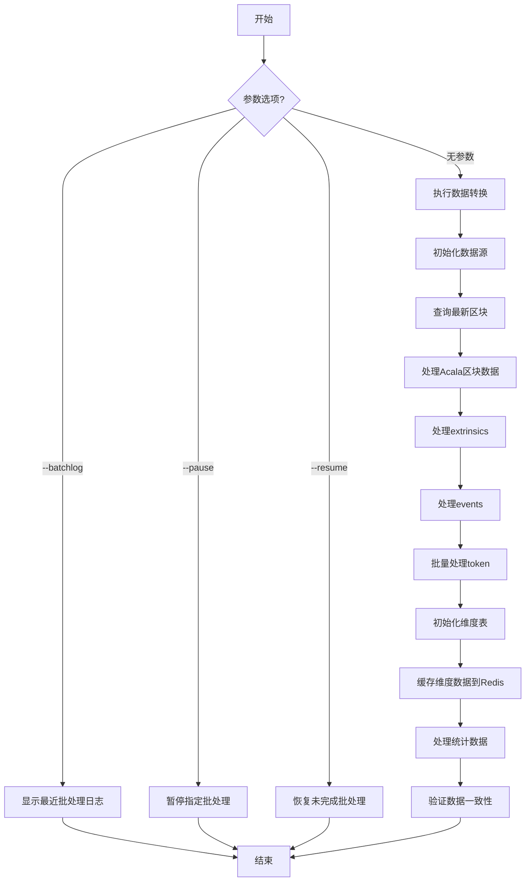
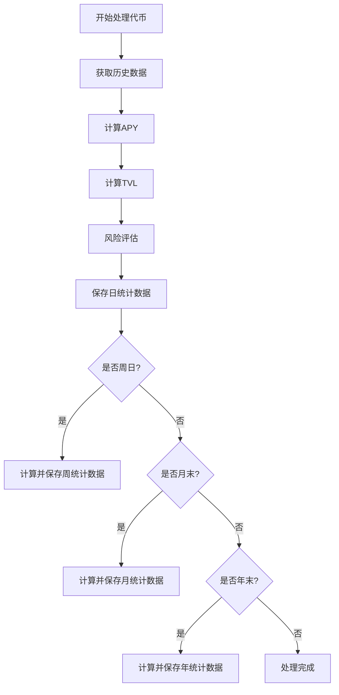

# Transform命令详解

## 功能说明
transform命令用于转换提取的Acala数据到维度表，主要功能包括：
- 查看最近转换批处理日志
- 暂停/恢复转换批处理
- 执行数据转换任务

## 执行流程图


## 参数说明
| 参数 | 缩写 | 必填 | 说明 |
|------|------|------|------|
| --batchlog | -b | 否 | 显示最近一次转换批处理日志 |
| --resume | -r | 否 | 恢复未完成的转换批处理 |
| --pause | -p | 否 | 暂停指定ID的转换批处理 |

## 处理逻辑
1. **参数解析**:
   - 检查输入参数
   - 确定执行模式(查看日志/暂停/恢复/转换)

2. **执行对应操作**:
   - 批处理日志: 查询并显示最近记录
   - 暂停批处理: 停止指定ID的批处理
   - 恢复批处理: 继续未完成的批处理
   - 数据转换: 执行标准转换流程

3. **数据转换核心流程**:
   - 初始化数据源和数据库连接
   - 查询最新区块作为参考点
   - 处理Acala区块数据收集token IDs
   - 处理extrinsics和events收集更多token IDs
   - 批量处理所有token到维度表
   - 初始化并缓存维度表数据(DimChain, DimAssetType等)
   - 处理token和yield统计数据
   - 验证数据一致性

4. **结果处理**:
   - 显示操作结果
   - 清理资源

## 典型使用场景
```bash
# 查看最近批处理日志
pnpm start transform -- --batchlog

# 暂停批处理ID为123的任务
pnpm start transform -- --pause=123

# 恢复未完成的批处理
pnpm start transform -- --resume

# 执行标准数据转换
pnpm start transform
```

## 逻辑图



## 详细流程说明

1. **获取历史数据**
   - 从数据库获取最近30天的yield统计数据
   - 包含APY、TVL等指标

2. **计算APY**
   - 基于7天平均日收益率计算年化收益率
   - 计算公式: `APY = (1 + avgDailyYield)^365 - 1`

3. **计算TVL**
   - 计算总锁定价值: `TVL = totalSupply * lockedRatio`
   - 计算美元价值: `TVL_USD = TVL * tokenPrice`

4. **风险评估**
   - 考虑代币年龄、流动性、审计状态等因素
   - 计算风险调整后的APY

5. **周期统计**
   - 每日: 计算并保存基础指标
   - 每周日: 额外计算周统计(交易量等)
   - 月末: 额外计算月统计
   - 年末: 额外计算年统计