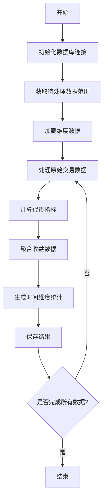

# Transform命令详解

## 功能说明
transform命令用于将原始区块链数据转换为分析友好的维度模型，主要功能包括：
- 原始交易数据标准化
- 代币统计指标计算
- 收益数据聚合
- 时间维度统计(日/周/月/年)

## 执行流程图


## 参数说明
| 参数 | 缩写 | 必填 | 说明 |
|------|------|------|------|
| --startDate | -s | 否 | 起始日期(YYYY-MM-DD) |
| --endDate | -e | 否 | 结束日期(YYYY-MM-DD) |
| --token | -t | 否 | 指定代币地址 |
| --force | -f | 否 | 强制重新计算(覆盖已有数据) |

## 处理逻辑
1. **数据准备阶段**:
   - 加载维度数据(代币、链等基础信息)
   - 确定处理范围:
     - 默认处理最近7天数据
     - 可指定日期范围或特定代币

2. **核心转换逻辑**:
   - 交易数据标准化:
     - 统一代币小数位处理
     - 价格换算为USD
   - 指标计算:
     - 交易量(原生代币和USD)
     - 交易次数
     - 年化收益率(APY)
     - 总锁定价值(TVL)

3. **聚合计算**:
   - 按时间维度(日/周/月/年)聚合
   - 计算同比/环比增长率
   - 生成标准化统计报表

4. **数据存储**:
   - 使用事务保证数据一致性
   - 增量更新优化性能
   - 支持数据重算(force参数)

## 典型使用场景
```bash
# 处理最近7天数据
ppnpm start transform

# 处理指定日期范围
ppnpm start transform -- --startDate=2025-01-01 --endDate=2025-01-31

# 处理特定代币
ppnpm start transform -- --token=0x123...abc

# 强制重新计算
ppnpm start transform -- --force
