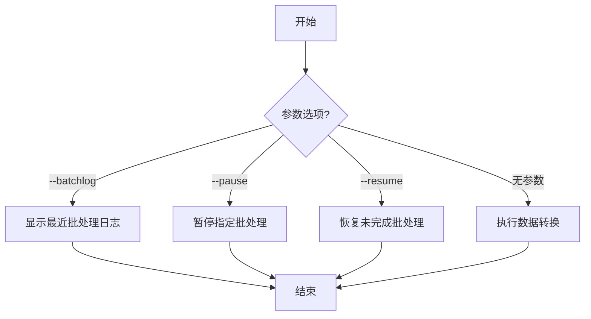

# Transform命令详解

## 功能说明
transform命令用于转换提取的Acala数据到维度表，主要功能包括：
- 查看最近转换批处理日志
- 暂停/恢复转换批处理
- 执行数据转换任务

## 执行流程图


## 参数说明
| 参数 | 缩写 | 必填 | 说明 |
|------|------|------|------|
| --batchlog | -b | 否 | 显示最近一次转换批处理日志 |
| --resume | -r | 否 | 恢复未完成的转换批处理 |
| --pause | -p | 否 | 暂停指定ID的转换批处理 |

## 处理逻辑
1. **参数解析**:
   - 检查输入参数
   - 确定执行模式(查看日志/暂停/恢复/转换)

2. **执行对应操作**:
   - 批处理日志: 查询并显示最近记录
   - 暂停批处理: 停止指定ID的批处理
   - 恢复批处理: 继续未完成的批处理
   - 数据转换: 执行标准转换流程

3. **结果处理**:
   - 显示操作结果
   - 清理资源

## 典型使用场景
```bash
# 查看最近批处理日志
pnpm start transform -- --batchlog

# 暂停批处理ID为123的任务
pnpm start transform -- --pause=123

# 恢复未完成的批处理
pnpm start transform -- --resume

# 执行标准数据转换
pnpm start transform
