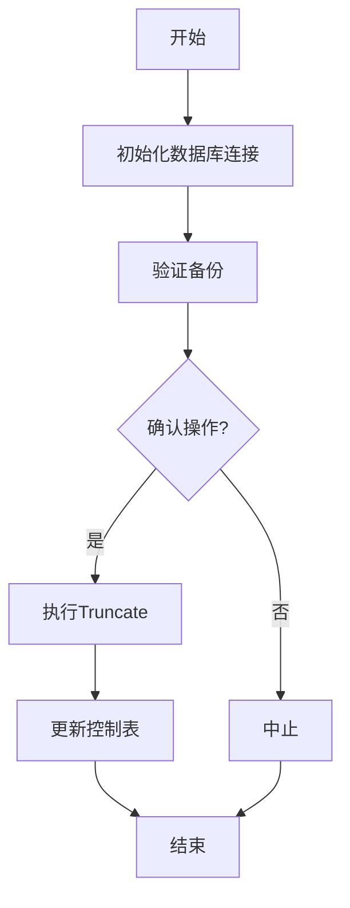

# Truncate命令详解

## 功能说明
truncate命令提供数据清理功能，主要包括：
- 清空特定表数据
- 重置ETL处理状态
- 维护清理过程中的数据库完整性
- 支持dry-run模式进行验证

## 执行流程图


## 参数说明
| 参数 | 缩写 | 必填 | 说明 |
|------|------|------|------|
| --table | -t | 是 | 要清空的表名 |
| --chain | -c | 否 | 链名称(默认全部) |
| --dry-run | -d | 否 | 预览变更而不执行 |
| --force | -f | 否 | 跳过确认提示 |

## 处理逻辑
1. **安全检查**:
   - 验证数据库备份存在
   - 检查是否有活跃进程
   - 验证表是否存在

2. **执行阶段**:
   - dry-run模式: 显示受影响的行数
   - 实际执行:
     - 禁用外键检查
     - 执行truncate
     - 重置自增计数器
     - 更新ETL控制表

3. **后处理**:
   - 记录操作详情
   - 通知监控系统
   - 记录到批处理日志

## 典型使用场景
```bash
# dry-run预览truncate操作
ppnpm start truncate -- --table=acala_block --dry-run

# 清空特定表
ppnpm start truncate -- --table=acala_block --force

# 清空特定链的数据
ppnpm start truncate -- --table=event --chain=bifrost
