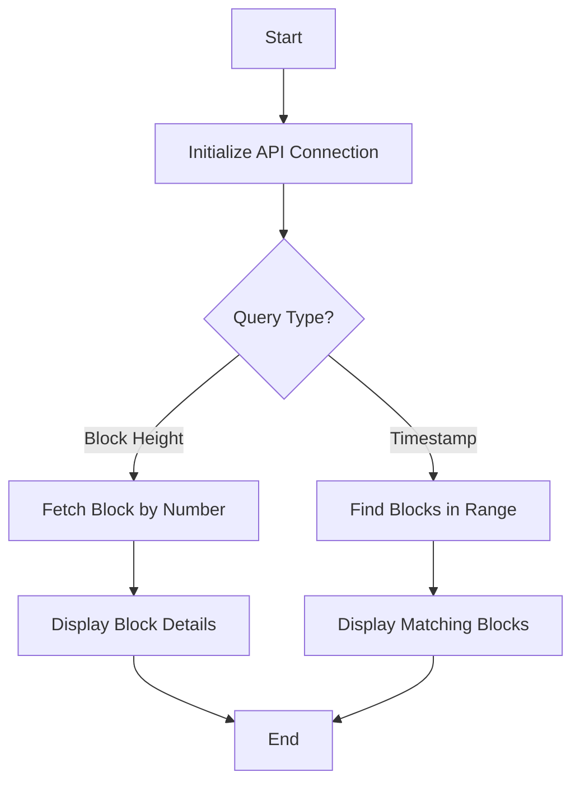

# Block Command Details

## Function Description
The block command provides block information querying capabilities, with main functions including:
- Query block details by height
- Search blocks by timestamp range
- Display block metadata (hash, timestamp, etc.)
- Show transaction/event counts

## Execution Flowchart


## Parameter Description
| Parameter | Short | Required | Description |
|-----------|-------|----------|-------------|
| --block | -b | No | Block number to query |
| --startTime | -s | No | Start timestamp (ISO format) |
| --endTime | -e | No | End timestamp (ISO format) |
| --chain | -c | No | Chain name (default acala) |

## Processing Logic
1. **Initialization**:
   - Connect to blockchain node RPC
   - Validate input parameters

2. **Query Execution**:
   - For block number queries:
     - Fetch full block details
     - Count transactions/events
   - For timestamp queries:
     - Binary search to find blocks in range
     - Display summary of matching blocks

3. **Output Formatting**:
   - Pretty-print JSON data
   - Highlight key information
   - Include metadata like query time

## Typical Usage
```bash
# Query specific block
ppnpm start block -- --block=1234567

# Find blocks between timestamps
ppnpm start block -- --startTime="2025-01-01T00:00:00Z" --endTime="2025-01-02T00:00:00Z"

# Query with chain specification
ppnpm start block -- --block=1234567 --chain=bifrost
