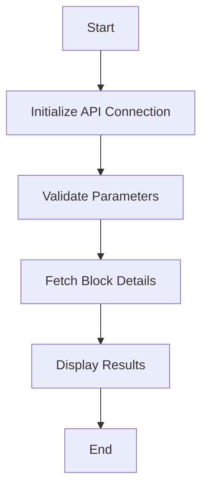

# Block Command Details

## Function Description
The block command provides block information querying capabilities, with main functions including:
- Query block details by time range
- Display block metadata (hash, timestamp, etc.)
- Show chain statistics

## Execution Flowchart


## Parameter Description
| Parameter | Short | Required | Description |
|-----------|-------|----------|-------------|
| --time-range | -t | No | Time range (e.g. 2h, 3d, 1w, 1m, 1y) |

## Processing Logic
1. **Initialization**:
   - Connect to blockchain node RPC
   - Initialize data source connection
   - Validate input parameters

2. **Query Execution**:
   - Fetch block details for specified time range
   - Calculate chain statistics
   - Format results for display

3. **Output**:
   - Display formatted results
   - Clean up resources

## Typical Usage
```bash
# Query blocks in last 24 hours
pnpm start block -- --time-range=1d

# Query blocks in last week
pnpm start block -- --time-range=1w

# Query blocks in last month 
pnpm start block -- --time-range=1m
