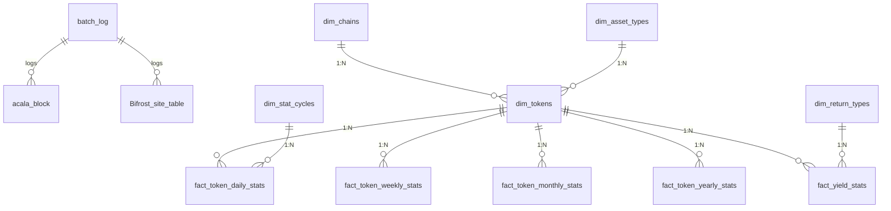

# Database Structure Documentation

## Database Architecture

The system uses three independent databases:

### 1. Batch Database (QUERYWEB3_BATCH)
- Stores batch task execution logs
- Main tables:
  - batch_log: Records batch task status and execution logs

### 2. Extract Database (QUERYWEB3_EXTRACT)
- Stores raw data extracted from chains
- Tables organized by chain:
  - Acala: acala_block, acala_event, acala_extrinsic
  - Bifrost: Bifrost_site_table, Bifrost_staking_table
  - Stellaswap: pool_data
  - Hydration: hydration_data

### 3. Transform Database (QUERYWEB3)
- Stores dimensional model data
- Contains:
  - Dimension tables: dim_asset_types, dim_chains etc.
  - Fact tables: fact_token_daily_stats etc.

## Schema Diagram



## Configuration

Configure three database connections in .env file:

```env
# Batch Database
BATCH_DB_HOST="127.0.0.1"
BATCH_DB_PORT="3306"
BATCH_DB_USER="root"
BATCH_DB_PASSWORD="password"
BATCH_DB_NAME="QUERYWEB3_BATCH"

# Extract Database
EXTRACT_DB_HOST="127.0.0.1"
EXTRACT_DB_PORT="3306"
EXTRACT_DB_USER="root"
EXTRACT_DB_PASSWORD="password"
EXTRACT_DB_NAME="QUERYWEB3_EXTRACT"

# Transform Database
TRANSFORM_DB_HOST="127.0.0.1"
TRANSFORM_DB_PORT="3306"
TRANSFORM_DB_USER="root"
TRANSFORM_DB_PASSWORD="password"
TRANSFORM_DB_NAME="QUERYWEB3"
```

## Initialization

Initialize databases using migration command:

```bash
# Initialize all databases
pnpm start migration --all

# Or initialize specific database
pnpm start migration --batch
pnpm start migration --extract
pnpm start migration --transform
```

## Table Details

(Keep existing table details...)
