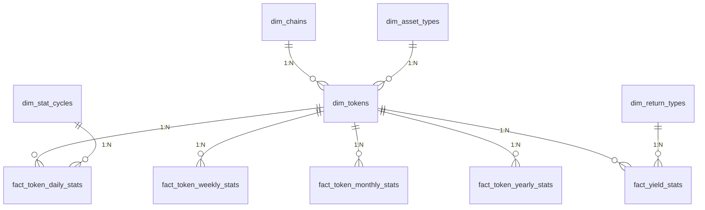

# Database Structure Documentation

## Overall Architecture

The database uses a star schema design, containing:
- **Raw data tables**: Store raw data extracted from chains
- **Dimension tables**: Store business dimensions
- **Fact tables**: Store business metrics



## Raw Data Tables

### Acala Chain
| Table | Description |
|-------|-------------|
| acala_block | Basic block information |
| acala_event | On-chain events |
| acala_extrinsic | Transaction data |
| acala_batchlog | Batch processing logs |

### Bifrost Chain
| Table | Description |
|-------|-------------|
| Bifrost_site_table | Site TVL/APY data |
| Bifrost_staking_table | Staking data |
| Bifrost_batchID_table | Batch IDs |

### Stellaswap
| Table | Description |
|-------|-------------|
| pool_data | Liquidity pool data |

### Hydration
| Table | Description |
|-------|-------------|
| hydration_data | Yield data |

## Dimension Tables

| Table | Description |
|-------|-------------|
| dim_asset_types | Asset types (DeFi/GameFi/NFT) |
| dim_chains | Blockchain networks |
| dim_return_types | Return types (Staking/Farming) |
| dim_stat_cycles | Stat cycles (daily/weekly etc.) |
| dim_tokens | Token information |

## Fact Tables

| Table | Description |
|-------|-------------|
| fact_token_daily_stats | Daily token stats |
| fact_token_weekly_stats | Weekly token stats |
| fact_token_monthly_stats | Monthly token stats |
| fact_token_yearly_stats | Yearly token stats |
| fact_yield_stats | Yield data |

## Relationship with ETL Process

### Extract Command
1. Extracts raw data from chains
2. Writes to corresponding raw data tables
3. Logs processing to batchlog tables

### Transform Command
1. Reads from raw data tables
2. Joins with dimension tables for transformation
3. Writes results to fact tables
4. Generates periodic stats

## Sample Queries

```sql
-- Query last 30 days token stats
SELECT * FROM fact_token_daily_stats 
WHERE token_id = 123 AND date >= DATE_SUB(NOW(), INTERVAL 30 DAY);

-- Query chain TVL ranking
SELECT c.name, SUM(f.tvl_usd) as total_tvl
FROM fact_yield_stats f
JOIN dim_tokens t ON f.token_id = t.id
JOIN dim_chains c ON t.chain_id = c.id
GROUP BY c.name
ORDER BY total_tvl DESC;
