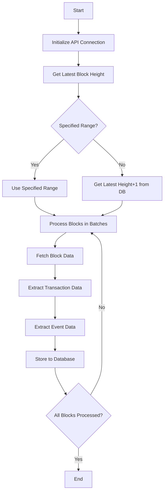

# Extract Command Details

## Function Description
The extract command is used to retrieve raw data from blockchain networks, including:
- Basic block information
- Transaction (extrinsic) data
- Event data
- Related metadata

## Execution Flowchart


## Parameter Description
| Parameter | Short | Required | Description |
|-----------|-------|----------|-------------|
| --startBlock | -s | No | Start block number (inclusive) |
| --endBlock | -e | No | End block number (inclusive) |
| --batchSize | -b | No | Blocks per batch (default 100) |
| --chain | -c | No | Chain name (default acala) |

## Processing Logic
1. **Initialization Phase**:
   - Establish RPC connection with blockchain node
   - Verify database connection
   - Determine processing range:
     - Use specified range if startBlock/endBlock provided
     - Otherwise get latest height+1 from database as start

2. **Data Processing Phase**:
   - Fetch block data in batches (default 100 blocks per batch)
   - Process transactions and events in parallel
   - Optimize database writes with batch inserts

3. **Error Handling**:
   - Auto-retry on RPC connection failures (max 3 times)
   - Log errors on database write failures
   - Support resume from last successfully processed block

4. **Performance Optimization**:
   - Use connection pool for database connections
   - Asynchronous parallel processing
   - In-memory batch caching

## Typical Usage
```bash
# Extract specific block range
ppnpm start extract -- --startBlock=1000000 --endBlock=1000100

# Continue from latest height
ppnpm start extract

# Use custom batch size
ppnpm start extract -- --batchSize=50
