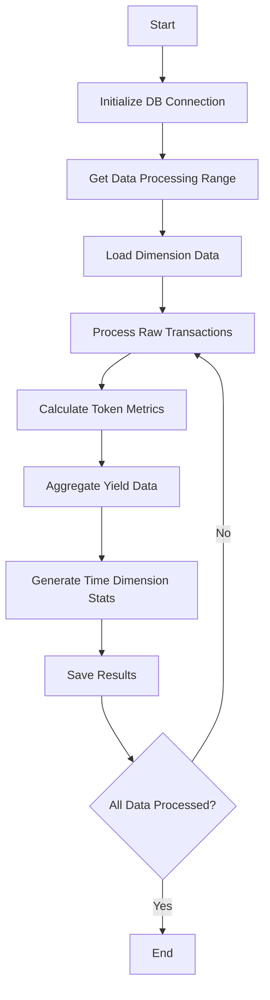

# Transform Command Details

## Function Description
The transform command converts raw blockchain data into analysis-friendly dimensional models, with main functions including:
- Standardization of raw transaction data
- Token metric calculations
- Yield data aggregation
- Time dimension statistics (daily/weekly/monthly/yearly)

## Execution Flowchart


## Parameter Description
| Parameter | Short | Required | Description |
|-----------|-------|----------|-------------|
| --startDate | -s | No | Start date (YYYY-MM-DD) |
| --endDate | -e | No | End date (YYYY-MM-DD) |
| --token | -t | No | Specific token address |
| --force | -f | No | Force recalculation (overwrite existing data) |

## Processing Logic
1. **Data Preparation Phase**:
   - Load dimension data (tokens, chains, etc.)
   - Determine processing scope:
     - Default: process last 7 days data
     - Can specify date range or specific token

2. **Core Transformation Logic**:
   - Transaction data standardization:
     - Unified token decimal handling
     - Price conversion to USD
   - Metric calculations:
     - Trading volume (native token and USD)
     - Transaction count
     - Annual Percentage Yield (APY)
     - Total Value Locked (TVL)

3. **Aggregation**:
   - Aggregate by time dimensions (day/week/month/year)
   - Calculate YoY/QoQ growth rates
   - Generate standardized reports

4. **Data Storage**:
   - Use transactions for data consistency
   - Optimize with incremental updates
   - Support data recalculation (force parameter)

## Typical Usage
```bash
# Process last 7 days data
ppnpm start transform

# Process specific date range
ppnpm start transform -- --startDate=2025-01-01 --endDate=2025-01-31

# Process specific token
ppnpm start transform -- --token=0x123...abc

# Force recalculation
ppnpm start transform -- --force
