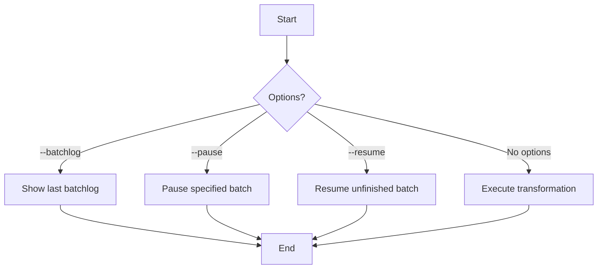

# Transform Command Details

## Function Description
The transform command converts extracted Acala data to dimensional tables, with main functions including:
- View last transform batchlog record
- Pause/resume transform batches
- Execute standard data transformation

## Execution Flowchart


## Parameter Description
| Parameter | Short | Required | Description |
|-----------|-------|----------|-------------|
| --batchlog | -b | No | Show last transform batchlog record |
| --resume | -r | No | Resume non-SUCCESS transform batch |
| --pause | -p | No | Pause running transform batch by ID |

## Processing Logic
1. **Parameter Parsing**:
   - Check input options
   - Determine execution mode (log/pause/resume/transform)

2. **Operation Execution**:
   - Batchlog: Query and display last record
   - Pause: Stop specified batch by ID
   - Resume: Continue unfinished batch
   - Transform: Execute standard transformation

3. **Result Handling**:
   - Display operation results
   - Clean up resources

## Typical Usage
```bash
# View last batchlog
pnpm start transform -- --batchlog

# Pause batch with ID 123
pnpm start transform -- --pause=123

# Resume unfinished batch
pnpm start transform -- --resume

# Execute standard transformation
pnpm start transform
