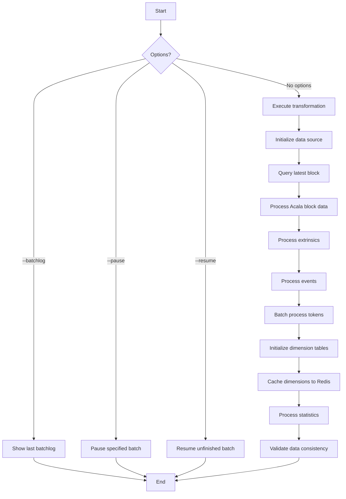
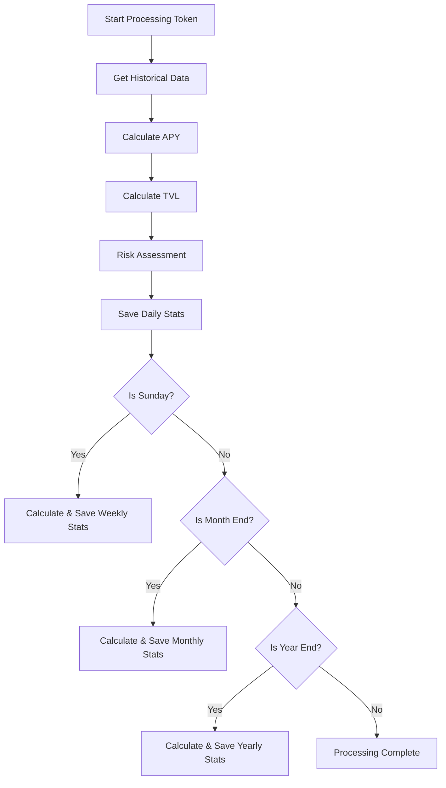

# Transform Command Details

## Function Description
The transform command converts extracted Acala data to dimensional tables, with main functions including:
- View last transform batchlog record
- Pause/resume transform batches
- Execute standard data transformation

## Execution Flowchart


## Parameter Description
| Parameter | Short | Required | Description |
|-----------|-------|----------|-------------|
| --batchlog | -b | No | Show last transform batchlog record |
| --resume | -r | No | Resume non-SUCCESS transform batch |
| --pause | -p | No | Pause running transform batch by ID |

## Processing Logic
1. **Parameter Parsing**:
   - Check input options
   - Determine execution mode (log/pause/resume/transform)

2. **Operation Execution**:
   - Batchlog: Query and display last record
   - Pause: Stop specified batch by ID
   - Resume: Continue unfinished batch
   - Transform: Execute standard transformation

3. **Core Transformation Flow**:
   - Initialize data source and database connection
   - Query latest block as reference point
   - Process Acala block data to collect token IDs
   - Process extrinsics and events to collect more token IDs
   - Batch process all tokens to dimension tables
   - Initialize and cache dimension tables (DimChain, DimAssetType etc.)
   - Process token and yield statistics
   - Validate data consistency

4. **Result Handling**:
   - Display operation results
   - Clean up resources

## Typical Usage
```bash
# View last batchlog
pnpm start transform -- --batchlog

# Pause batch with ID 123
pnpm start transform -- --pause=123

# Resume unfinished batch
pnpm start transform -- --resume

# Execute standard transformation
pnpm start transform
```

## Logic chart



## Detailed Process Explanation

1. **Get Historical Data**
   - Fetch last 30 days yield stats from database
   - Includes metrics like APY, TVL etc.

2. **Calculate APY**
   - Annualized yield based on 7-day average daily yield
   - Formula: `APY = (1 + avgDailyYield)^365 - 1`

3. **Calculate TVL**
   - Total Value Locked: `TVL = totalSupply * lockedRatio`
   - USD Value: `TVL_USD = TVL * tokenPrice`

4. **Risk Assessment**
   - Consider token age, liquidity, audit status etc.
   - Calculate risk-adjusted APY

5. **Periodic Stats**
   - Daily: Calculate and save basic metrics
   - Weekly (Sunday): Additional weekly stats (volume etc.)
   - Monthly (Month end): Additional monthly stats
   - Yearly (Year end): Additional yearly stats