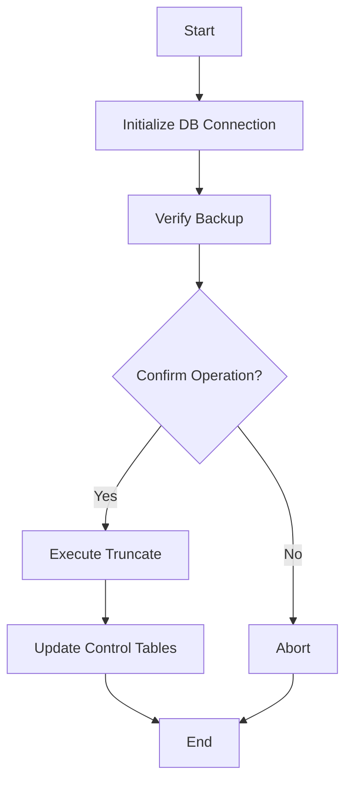

# Truncate Command Details

## Function Description
The truncate command provides data cleanup capabilities, with main functions including:
- Clear specific table data
- Reset ETL processing state
- Maintain database integrity during cleanup
- Support dry-run mode for verification

## Execution Flowchart


## Parameter Description
| Parameter | Short | Required | Description |
|-----------|-------|----------|-------------|
| --table | -t | Yes | Table name to truncate |
| --chain | -c | No | Chain name (default all) |
| --dry-run | -d | No | Preview changes without executing |
| --force | -f | No | Skip confirmation prompts |

## Processing Logic
1. **Safety Checks**:
   - Verify database backup exists
   - Check for active processes
   - Validate table exists

2. **Execution Phase**:
   - For dry-run: show affected row counts
   - For actual truncate:
     - Disable foreign key checks
     - Perform truncate
     - Reset auto-increment counters
     - Update ETL control tables

3. **Post-Processing**:
   - Log operation details
   - Notify monitoring systems
   - Record in batch log

## Typical Usage
```bash
# Dry-run to preview truncate
ppnpm start truncate -- --table=acala_block --dry-run

# Truncate specific table
ppnpm start truncate -- --table=acala_block --force

# Truncate chain-specific data
ppnpm start truncate -- --table=event --chain=bifrost
